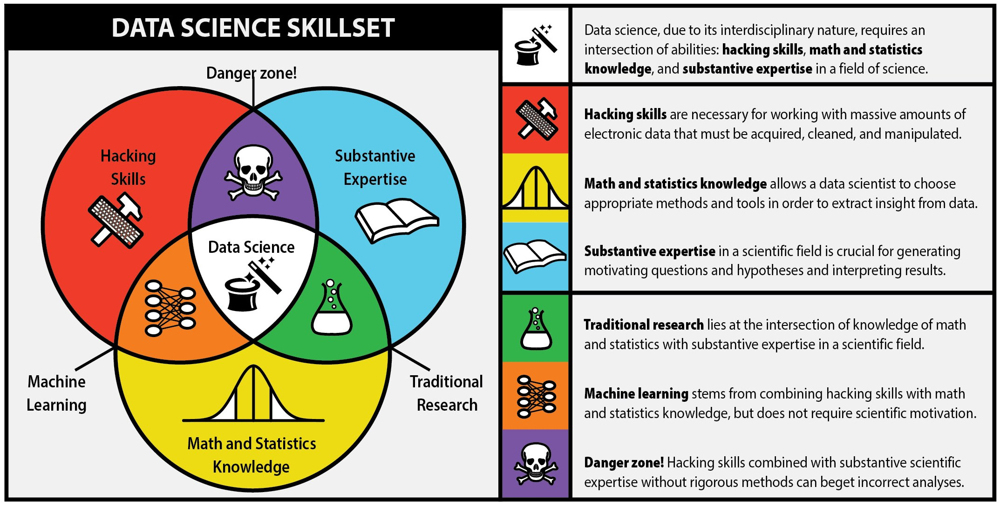
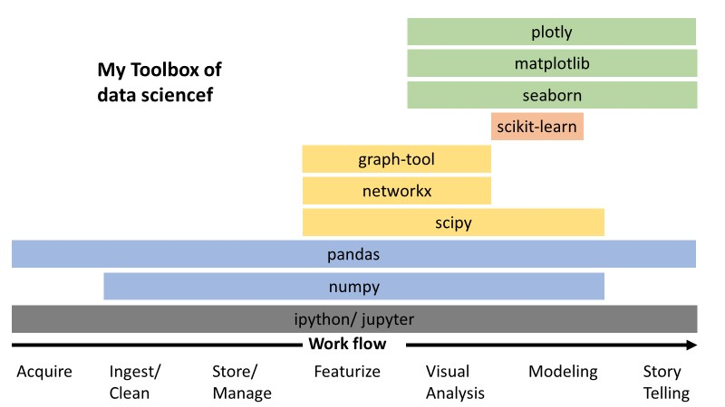

### What is data science?
Drew Conway plotted a Venn Diagram and modified by Natalia Bilenko (Fig.1) to show data science is a interdisciplinary subject. Statisticians are specialised in models and summarising datasets. Computer Scientists are familiar with algorithms and good at processing, storing and visulasing the data. Expertise defines the questions and presents the answers.

 
 
<b>Fig.1 Drew Conway's Data Science Vem Diagram</b>

### What are the tools of a data scientist for python users?
Christian Staudt addressed [a speech about the python ecosystem](https://www.youtube.com/watch?v=EBgUiuFXE3E&t=2s). The python modules I am using are:

 
 
<b>Fig.2 My python toolbox for data analysis</b>

