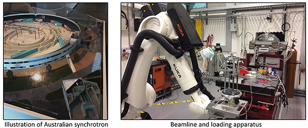

Geometries of granular materials can be digitalised as images using imaging techniques. Then, the samples can be virtually reconstructed to compute particle size, shape and other microstructural variables. Some imaging techniques are summarised in the Table below. Among them, CT has become the most prevalent one to achieve 3D morphological information of granular materials. It currently acts as a mean to characterise specimen heterogeneity, to visualise multiphase flow, and to track shear deformation and fracture characteristics. However, only a few studies have used this 3D information to ‘mine’ or extract and fundamentally understand other key geomaterial properties.

**Table Overview of image techniques**  

| **Techniques** | **Theory** | **Comments** |
| --- | --- | --- |
| Optical Microscope (OM) | Visible light and a series of lenses are used to magnify images of small objects. | Cannot scan the interior structure of granular assemblies;Low accurate reconstruction of grain with an irregular shape. |
| --- | --- | --- |
| Scanning Electron Microscopy (SEM) | A focused beam of electrons interacting with atoms in the samples is employed to produce various signals. | Samples are required to be sliced;Can apply X-Ray to classify the constituents (mineralogy) of the particles. |
| --- | --- | --- |
| Optical Tomography (OT) | Light transfers and scatters through an object rotated at regular angular intervals. | Samples over mm and cm scales;Lower accuracy but relatively cheap;It works well on soft tissue in the medical field. |
| --- | --- | --- |
| X-Ray Computed Tomography (X-Ray CT) | A sample is placed between an X-ray source and an X-ray detector; then the detector rotates systematically to record 2D radiographs at different angles from 0° to 360°. | Ideal to objects with distinguished X-ray absorption coefficient (dense materials);Performs badly for a mixture of objects with low and high density together;CT images can be identified by simple threshold-based tools. |
| --- | --- | --- |
| Magnetic Resonance Imaging (MRI) | A magnetic field is created by a cylindrical magnet that acts on protons in water and generates echo because of the MRI scan&#39;s radio waves. Then these echoes can be captured and organised into images by a computer. | Water &#39;X-ray&#39;;Can obtain information on flow pathways, water content and liquid flow velocity .Ideal for distinguishing between different soft tissues in the medical field;Can take cross-sectional images of an object from almost any angle;Manual segmentations are necessary. |

**Please cite our papers below related to CT imaging**
- **Fei W**, Narsilio GA. Impact of Three-Dimensional Sphericity and Roundness on Coordination Number. Journal of Geotechnical and Geoenvironmental Engineering 2020, 146:06020025, [doi](https://doi.org/10.1061/(ASCE)GT.1943-5606.0002389).
- **Fei W**, Narsilio GA. Network analysis of heat transfer in sands. Computers and Geotechnics 2020, 127:103773, [doi](:https://doi.org/10.1016/j.compgeo.2020.103773).
- **Fei W**, Narsilio GA, van der Linden JH, Disfani MM. Quantifying the impact of rigid interparticle structures on heat transfer in granular materials using networks. International Journal of Heat and Mass Transfer 2019, 143:118514, [doi](https://doi.org/10.1016/j.ijheatmasstransfer.2019.118514).
- **Fei W**, Narsilio GA, Disfani MM. Impact of three-dimensional sphericity and roundness on heat transfer in granular materials. Powder Technology 2019, 355:770-781, [doi](https://doi.org/10.1016/j.powtec.2019.07.094).

**Acknowledge Australian Synchrotron**  
Wenbin succeeded in applying for a grant from Australian Synchrotron [AS1/IMBL/15795] to conduct 48 hours (Equivalent AUD 65,568) of CT scanning in February 2020.

 
 
<b>Fig.2 My python toolbox for data analysis</b>

