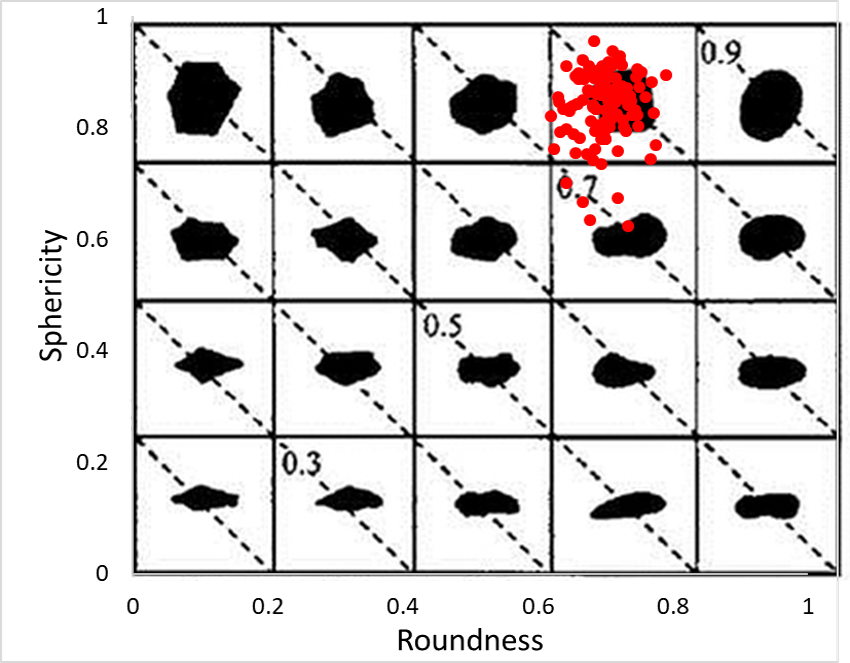

A tool has been developed used to calculate paritlce shape descriptors.

The red points in the following figure show the particle shape of each particle in a Ottawa sand assembly.

 
 
<b>Fig.1 Particle shape of Ottawa sand</b>

