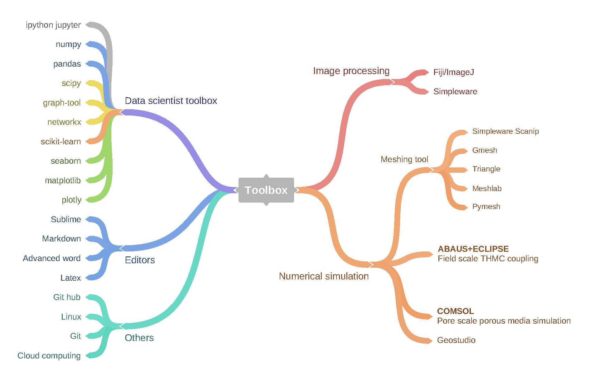

### Pore/particle scale modeling platform

We developed a toolbox to extract micro-structure features (data), analyze the relationship between features, predict properties of granular materials and unveil their patterns. This toolbox is made up of nine building blocks. For different applications, several blocks can be used to fulfill the task. In this platform, image stacks could be achieved from computed tomography imaging in block 1. Then the sample can be reconstructed to extract the particle/pore geometry and their morphology in block 2. The reconstructed sample in block 2 then can be used to simulate heat transfer so we can calculate thermal conductivity, observe the temperature and heat flux distribution. etc. If we want more samples, the irregular particles can be extracted from block 2 and then we will have a database of irregular particles, by means of discrete element method, artificial samples could be generated. Different networks can be constructed for both the CT reconstructed samples or DEM samples. A network is a web containing nodes and edges, e.g. in contact network, a node is assigned to the center of each particle, an edge will be assigned if two particles touch. After building the networks, network features could be computed with complex network theory. All the data generated in the former block will be collected into a feature set in block 6. The resulting feature set is used for model selection (block 7) and identify the feature importance (block 8). Finally, we can used the trained model to generate predictions in block 9 and patterns in block 10.  

<body>
     
</body>

### Industrial-level THMC numerical simulation
A Thermo-Hydro-Chemical (THC) coupling process for multiphase flow in porous media is considered in ECLIPSE. The linker program “AEEA Coupler” then reads the information of locations and variables, such as temperature, pore pressure and saturation from ECLIPSE. Based on these data, the AEEA Coupler calculates the values of temperature and pore pressure and populates them for the finite element (FE) meshes that are used in ABAQUS. Then, ABAQUS is run for a Thermo-Hydro-Mechanical (THM) coupling analysis using the updated information, and new porosity, permeability and capillary pressure are obtained and used to update the values in the ECLIPSE through the AEEA Coupler.

<body>
	
 
	     
	    <b>Fig.1. Schematic diagram of the AEEA Coupler.</b>
	

</body>

The entire thermo-hydro-mechanic-chemical (THMC) coupled processes for multiphase flow is sequentially and explicitly considered between ABAQUS and ECLIPSE through the developed AEEA Coupler. First, a THC coupling analysis is conducted between tk and tk + 1 in ECLIPSE, and its results are passed to ABAQUS in tk. Next, a THM coupling analysis is carried out between tk and tk + 1 in ABAQUS, and the results of ABAQUS are passed back to ECLIPSE in tk + 1 to perform the simulation for the next time step.

<body>
	
 
	     
	    <b>Fig.2. Time steps and variables update in coupling analyses.</b>
	

</body>

### My toolbox

<body>
     
</body>

<map name="Toolbox">
    <area shape="rect" coords="129,751,266,780" href="https://wenbinfei.github.io/toolbox/markdown/" title="Markdown" alt="Markdown" />
    <area shape="rect" coords="395,303,704,342" href="https://wenbinfei.github.io/data-science/" title="Data_science" alt="Data_science" />
    <area shape="rect" coords="1383,214,1524,247" href="https://wenbinfei.github.io/toolbox/imagej/" title="Fiji" alt="Fiji" />
</map>

#### Editors
- **[Markdown](markdown.md)**: A popular language with plain text formatting syntax and easy to be converted to html.

- **[Sublime Text](../_posts/2021-01-06-sublime-vim.md)**: A sophisticated text editor for code, markup and prose. Vim is avaliable in Vintage mode.

#### Data science toolbox
- **[Seaborn & Matplotlib-Q & A](Seaborn-matplotlib.md)**: Python libraries to visualize your data.

#### Image Processing
- **[ImageJ](imagej.md)**: ImageJ is a free software that used to deal with CT images.

#### Others
- **[Git](Git.md)**: Git is a distributed version control system for tracking changes in source code when developing software.
